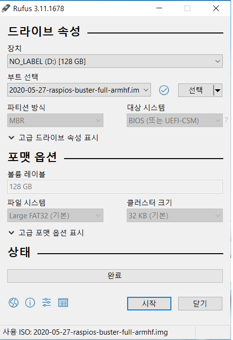

## Installation_raspbian


**경고_설치 방법은 PC 운영체제 윈도우10 기준입니다.**


<www.raspberrypi.org> 접속 후, 상단 메뉴에서 Software 선택

다운받는 옵션에 맞게 라즈비안을 설치합니다.

다운 받은 라즈비안 이미지파일(.img)을 SD카드에 이동시킵니다. 

**주의) SD카드가 FAT32 상태여야 합니다. 새로 구매한 경우 그대로 사용하면 됩니다. 

**단,기존에 사용해 왔던 SD카드라면 SD카드 포맷 응용프로그램으로 SD카드를 포맷해야 합니다.**

<https://rufus.ie/> 에서 응용프로그램을 다운로드 받거나(설명도 있습니다.) 다음 git 명령을 통해 다운받을 수 있습니다.

```
$ git clone git://github.com/pbatard/rufus
```
**rufus.exe으로 FAT상태로 초기화**



라즈베리파이에 SD카드를 넣고 전원을 연결합니다. HDMI를 통해 디스플레이 장치와 연결을 합니다. 

### Raspbian start

첫 페이지에서 Next를 선택합니다.

- Set Country

>Country: GB(혹은 US)
  
>Language: English

>Timezone: London(혹은 NewYork)
  
>설정 후 Next

- Change Password
  
>아무 입력없이 Next를 하면 default값으로 자동 설정된다. (pi/raspberry)
  
>추천 - 아무 입력 없이 Next

- Select WiFi Network
  
>Skip
  
- Update Software
  
>**라즈비안 Updatesoftware 페이지는 반드시 스킵합니다.**
  
>Skip

- Setup Complete
  
>Reboot
